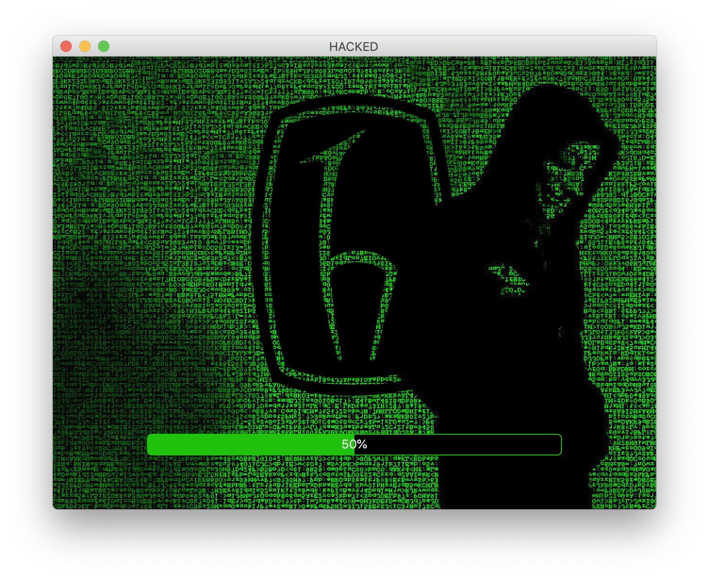
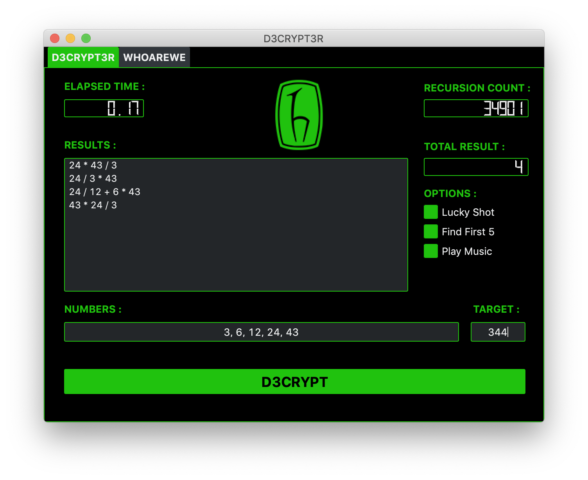
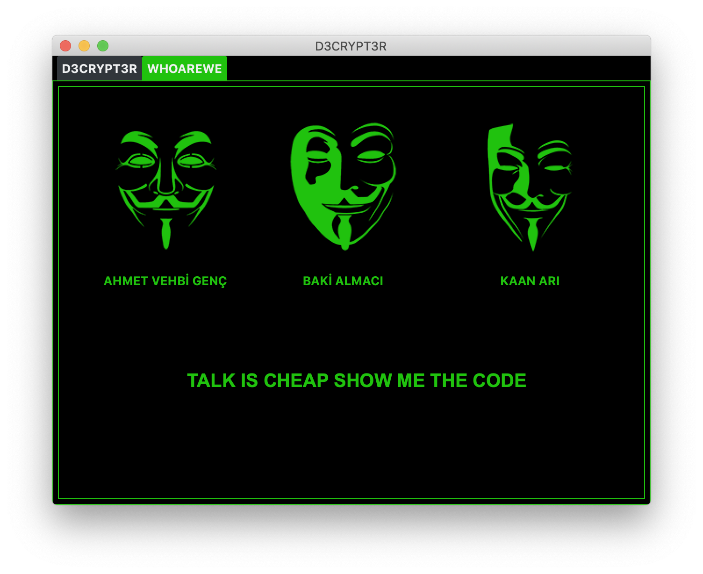

# Introduction

This project created to implement ELE 411 Data Structures subjects by Kaan ARI, Muhammed Baki ALMACI and Ahmet Vehbi GENÇ. 

## Contents

+ In this project we want to create a program which solves "Bir İşlem" part of the "Bir Kelime Bir İşlem" TV contest. We have implemented it with a Graphical User Interface which looks like a KeyGen or Cracker.  

## Screen Shots

## Authors

👤 **Kaan ARI**  
👤 **Muhammed Baki ALMACI**  
👤 **Ahmet Vehbi GENÇ**  
